# Equity Research Toolkit

[](https://github.com/oscarschjelderup-sketch/equity-research-toolkit/actions/workflows/ci.yml)

**An Excel valuation model written entirely in Python, a pitch deck generated from it, and one real case – SATS ASA –
run through both. Every number in the deck comes from one workbook, and the workbook checks itself.**

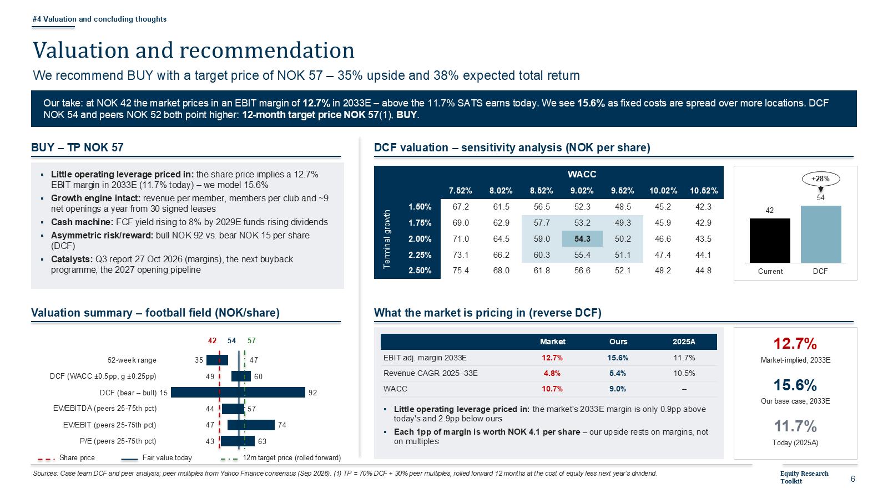

The toolkit grew out of the Pareto Securities equity research case competition, where a team has a few days to value a
Nordic listed company and pitch it on four slides with fixed headings: *Company overview, Market overview, Financials and
estimates, Valuation and recommendation*. The time goes on the mechanics – historicals, a three-statement forecast, a DCF
that ties, sensitivities, charts – and too little on the judgement. So the mechanics are code here:

- the **model** is built by `model_builder/` with openpyxl and finished in Excel (data tables, full recalculation) – change
  the code, rebuild, and nothing drifts;
- the **deck** and a **chart library** are built by `deck_builder/` with python-pptx from the saved workbook – native,
  editable PowerPoint charts and tables;
- a **case** is one data file: `model_builder/sats_data.py` holds seven years of SATS history from the company's own
  reports, the forecast drivers, scenarios, consensus, the thesis and its kill criteria.

The sibling project [equity-research-engine](https://github.com/oscarschjelderup-sketch/equity-research-engine) automates
the other end – one command from a ticker to a deck. This repository is the analyst's workbench: a hand-built driver model
where every assumption is visible, sourced and stress-tested.

## The SATS ASA case

| As of 30 September 2026, share price NOK 42.30 | |
|---|---|
| Recommendation | **BUY**, 12-month target price **NOK 57** (+35%, 38% total return) |
| DCF value per share / blended fair value | NOK 54.3 / NOK 53.6 (70% DCF, 30% peer multiples) |
| Bear / base / bull (DCF) | NOK 15 / 54 / 92, probability-weighted 54 |
| What the share price implies | an EBIT margin (pre-IFRS 16) of 12.7% in 2033 – we model 15.6%, SATS earned 11.7% in 2025 |
| WACC / terminal growth | 9.0% / 2.0%, terminal value 66% of EV |

The thesis is operating leverage: about 70% of personnel costs and 60% of other operating costs are fixed per club and
rent is indexed per club, so price increases and fuller clubs lift the margin. The market prices in little of it.
The [red-team notes](#what-would-make-the-case-wrong) below list where the case is weakest.

| | |
|---|---|
| 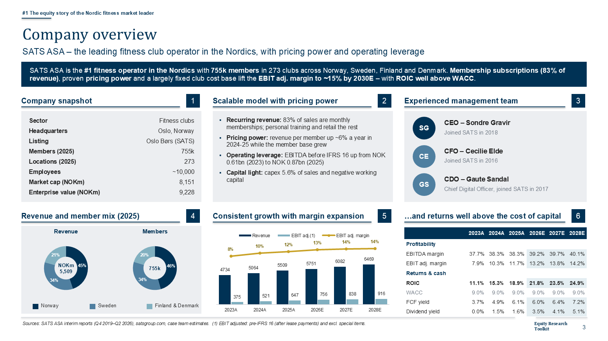 | 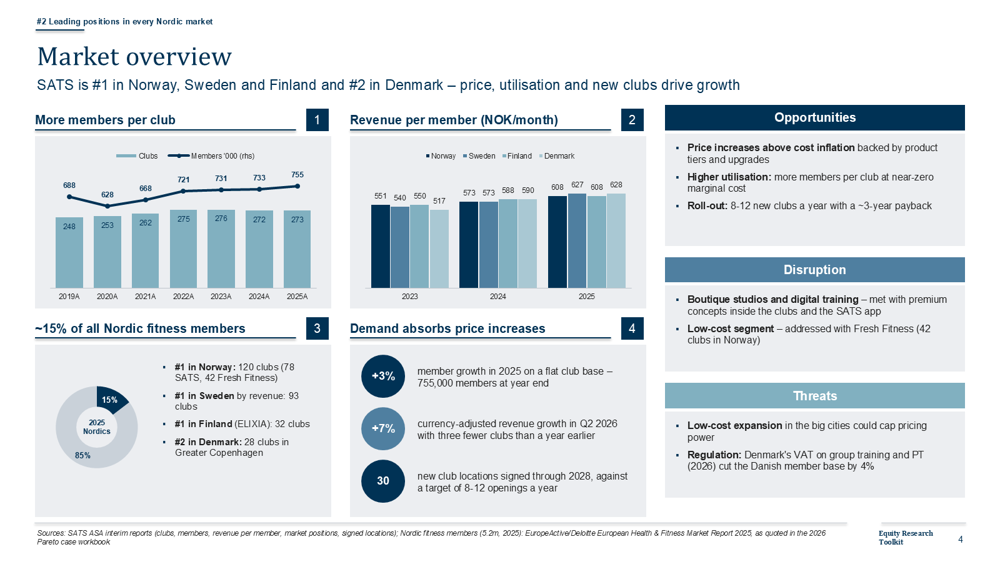 |
| 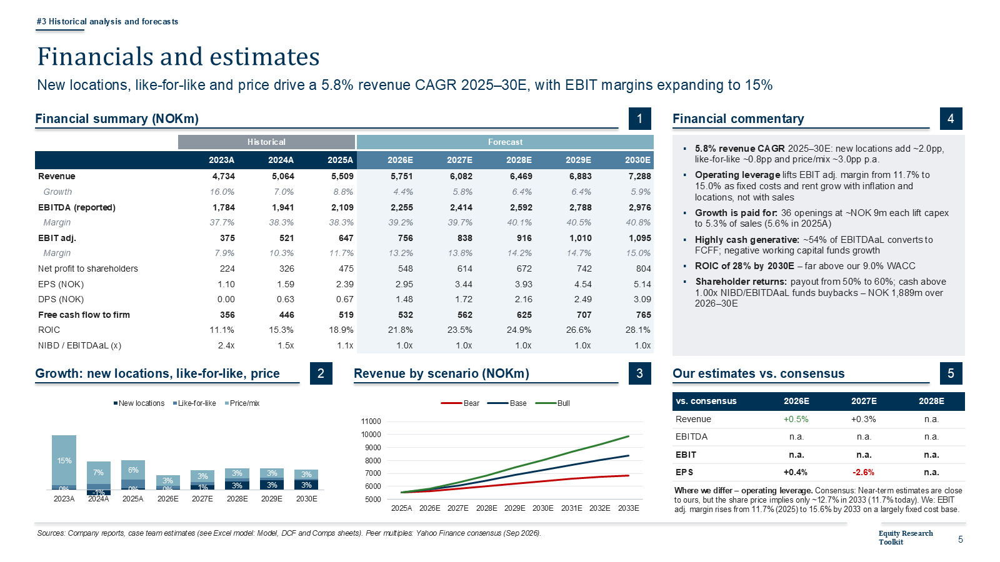 | 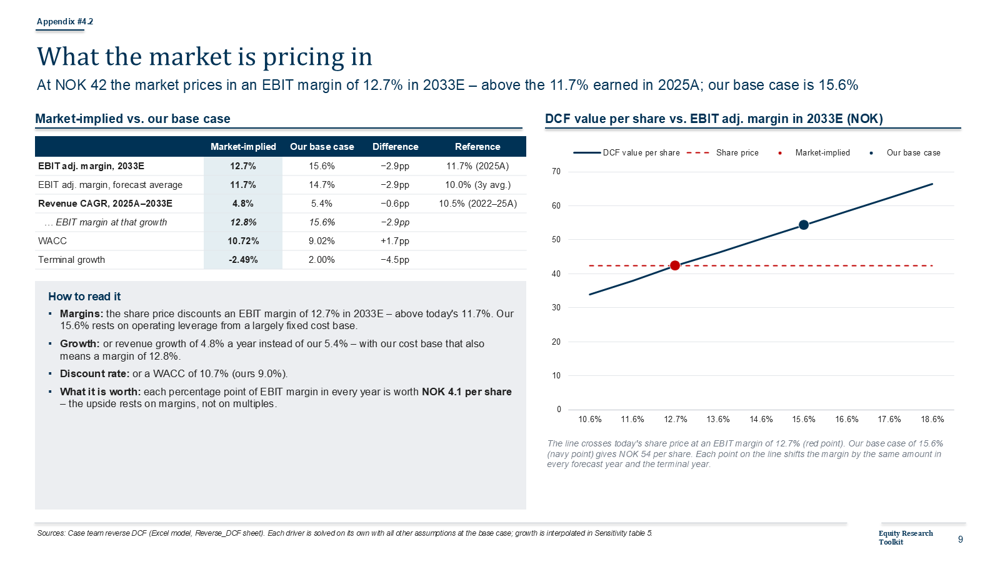 |
| 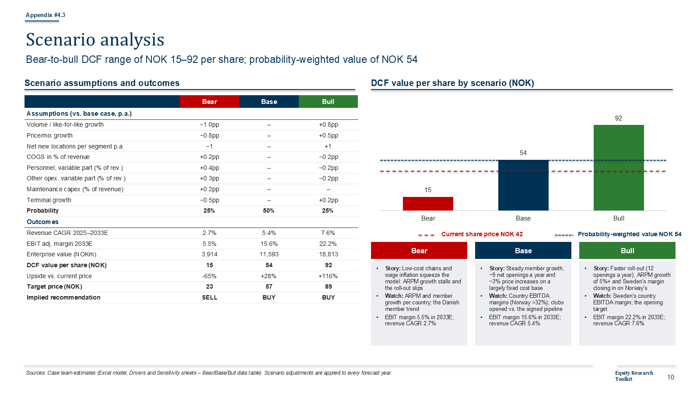 | 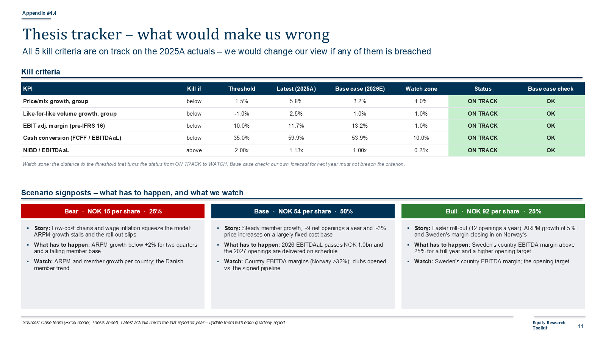 |
| 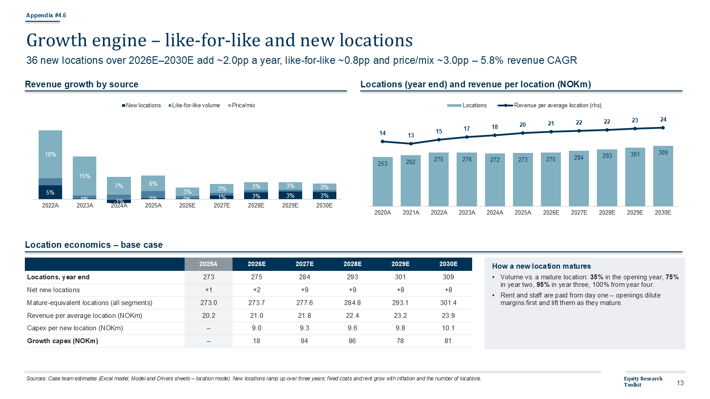 | 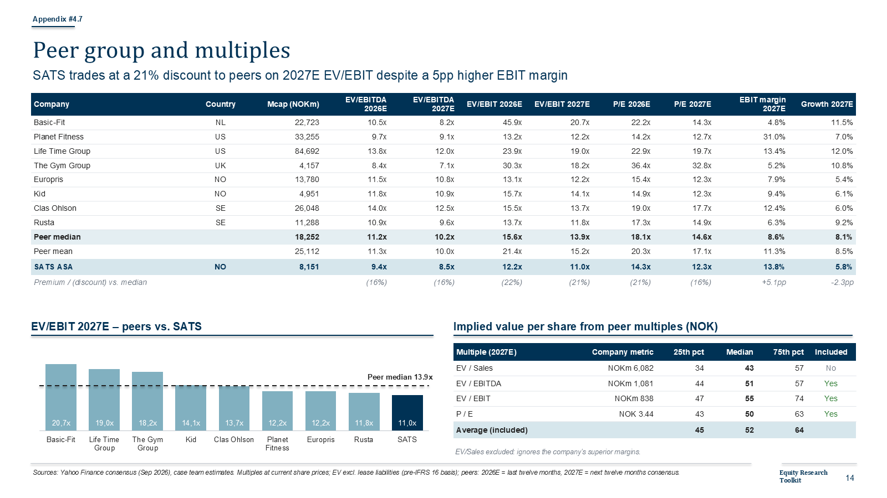 |

Files in [`examples/SATS`](examples/SATS): the workbook, the full 16-slide deck (four content slides plus a nine-slide
appendix for Q&A) and the six-slide submission version. *A case exercise, not investment advice.*

## The workbook

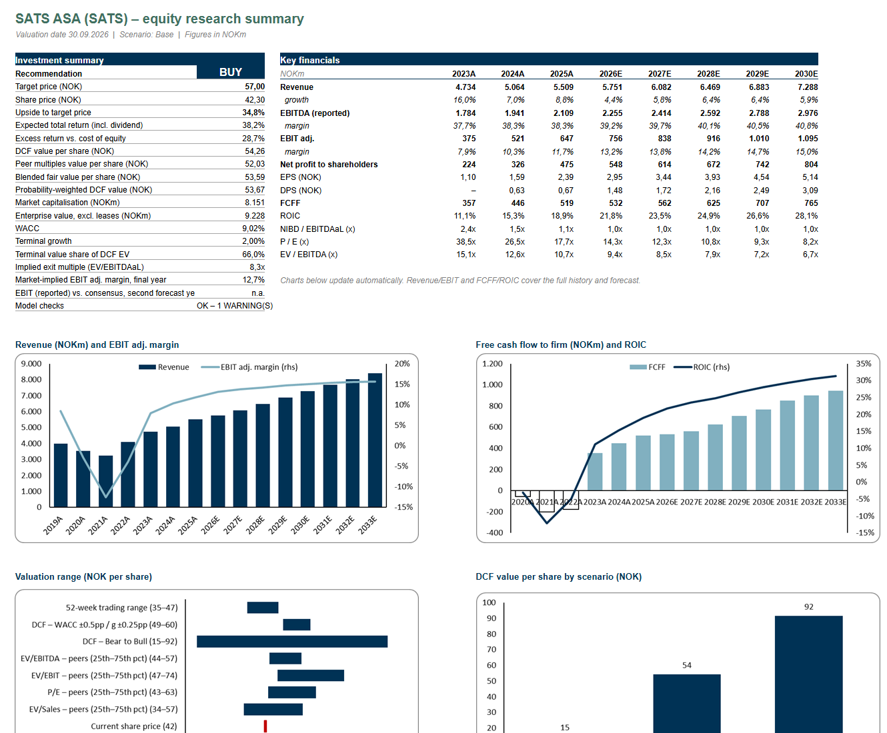

25 sheets in five sections, laid out like a sell-side model (inputs in blue, one formula per row, years across):

| Section | Sheets | What happens there |
|---|---|---|
| Inputs | Inputs, Hist, Drivers | Market data and the EV bridge; seven years of reported figures; forecast drivers with history next to them, scenario adjustments, terminal and capital-allocation settings |
| Calculations | Model | Revenue build, costs, IFRS 16 split, capex, working capital, debt, buybacks – one engine for every scenario |
| Output | Output, Analysis | Income statement, balance sheet and cash flow that balance; margins, returns, cash conversion, per-share data |
| Valuation | WACC, DCF, Sensitivity, Comps, Football | WACC from peer betas; DCF; five sensitivity tables (three of them Excel data tables); peer multiples; football field |
| Market view | Reverse_DCF, Consensus, Thesis | What the share price implies; our estimates against consensus and the variant perception; scenario stories and kill criteria checked against the latest actuals |
| Summary | Dashboard, Deck_Feed, Checks | One-page summary, the values the deck reads, 30 integrity checks |

Choices that matter:

- **Leases are treated consistently.** Free cash flow is after lease payments (pre-IFRS 16), so lease liabilities are not
  deducted, the WACC excludes them and peer multiples are lease-adjusted too. Mixing the two bases is the most common way
  a DCF of a store or gym chain goes wrong.
- **A location engine drives revenue** (or, switchable, a simple volume × price build per segment). Revenue is
  mature-equivalent locations × volume per mature location × price; new locations ramp up over three years. Fixed costs
  and rent grow with inflation and the number of locations, not with revenue – that is where operating leverage comes
  from, and the model shows it rather than assuming a margin.
- **Growth has to be paid for.** Growth capex is openings × capex per location; the terminal value uses the value-driver
  formula, so terminal growth needs reinvestment at a stated return on new capital.
- **Capital allocation is modelled.** Cash above a target leverage goes to buybacks; the WACC can follow the modelled
  capital structure.
- **The rating is earned.** BUY or SELL only when the expected total return beats or misses the cost of equity by 5pp.

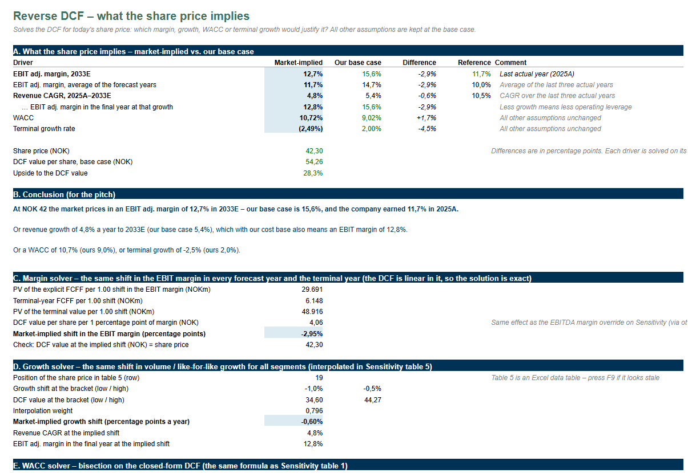

## How the numbers are checked

- **30 integrity checks** in the workbook: the balance sheet balances, the cash flow ties to net debt, the sensitivity
  centre equals the DCF, data-table inputs are blank, terminal value share, RONIC above WACC, utilisation of locations,
  the reverse DCF is solved, the base case does not breach its own kill criteria … Errors must be fixed; warnings must be
  explained.
- **`verify_dcf.py`** recalculates the forecast and the DCF in plain Python, independently of Excel, and compares
  (they agree to 12 decimals). It then puts each market-implied value from the reverse DCF back in: the value must come out
  at the share price.
- **`stress_test.py`** flips switches and scenarios in Excel – bear and bull, segment build, mid-year off, terminal
  method, peer basis, WACC override, valuation date, buybacks off, capital-intensive growth – and reports the checks for
  each.
- **`whatif_runs.py`** changes one input at a time (price growth, cost inflation, openings, WACC, RONIC …) and records the
  value, target price and rating – the table to have open when a jury asks "what if …".
- **CI** (this repository's tests, on Linux): both workbooks build from code with the layout the decks expect, the
  committed workbooks pass their own checks, and every deck builds.

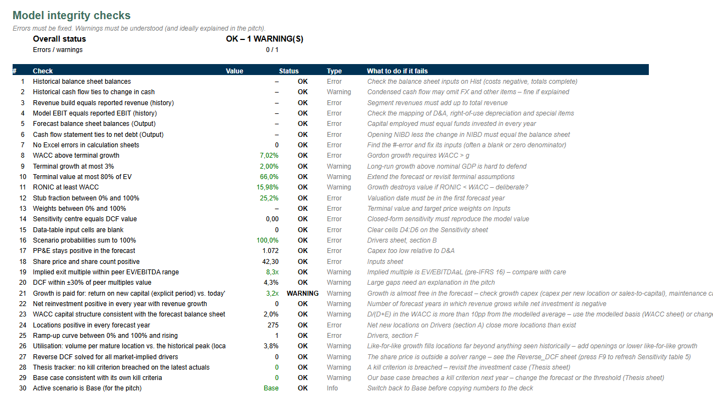

## What would make the case wrong

A red-team pass on our own BUY, with the model's answers:

- **The BUY is a bet on prices outrunning costs.** Price growth 0.5pp lower and cost inflation 0.5pp higher every year
  give NOK 38 – a HOLD. Price growth 1pp lower alone gives NOK 35, a SELL. Price/mix below 1.5% is kill criterion #1.
- **Personnel costs have moved the wrong way** – from 35.4% of revenue in 2023 to 37.3% in 2025. We assume 35.2% by 2033.
- **The bear case is steep (NOK 15).** It stacks every negative in every year; operating leverage cuts both ways.
- **Near term we are in line with consensus**, not above it (2026E EPS 2.95 vs 2.94). The difference is the margin after
  2027 – exactly what the reverse DCF isolates.
- **One warning is left on purpose**: the return on new capital in the forecast (79%) is far above the terminal 25%,
  because most growth comes from price and utilisation of existing clubs, which needs no capital, and members prepay.

## Quick start

```bash
pip install -r requirements.txt

# Decks (any OS) – no template needed: the layout is drawn without any logo
cd deck_builder
python build_deck.py --template none --out ../my_deck.pptx               # fictional Example Company ASA
EQR_CASE=sats_data python build_deck.py --template none \
    --model ../examples/SATS/SATS_ASA_DCF_Model.xlsx --map ../model_builder/model_map_sats.json \
    --out ../my_sats_deck.pptx                                           # add --main-only for the 4-slide version
EQR_TEMPLATE=none python build_chartlib.py ../my_chart_library.pptx      # 23-slide chart and framework library
```

Rebuilding the workbook needs Excel on Windows (for the data tables and the full recalculation):

```bash
cd model_builder
export EQR_CASE=sats_data EQR_MAP=model_map_sats.json EQR_MODEL=sats_final.xlsx
python build_model.py sats_raw.xlsx
python excel_finalize.py sats_raw.xlsx sats_final.xlsx
python verify_dcf.py
python stress_test.py
```

Without `EQR_CASE` the builders use the fictional Example Company ASA (`example_data.py`), which is what
`Equity_Research_DCF_Toolkit.xlsx` at the root contains. `pytest` runs the tests.

**A new company** is a copy of `model_builder/sats_data.py` with the same keys filled in – seven years of history,
market data, drivers, scenarios, consensus, the variant perception, kill criteria and peers. `simulate()` refuses to
build if a balance sheet does not balance or a cash flow does not tie. Company-specific slide text goes in
`deck_builder/<company>_deck.py`. Details in [`model_builder/README.md`](model_builder/README.md) and
[`deck_builder/README.md`](deck_builder/README.md).

**With the competition template:** save it as `Equity_Research_Pitch_Template.pptx` in the root (git-ignored) or pass
`--template path/to/template.pptx`; the decks then use its layouts and placeholders instead of the neutral layout.

## Repository layout

```
Equity_Research_DCF_Toolkit.xlsx   the workbook for the fictional Example Company ASA – the template
model_builder/                     builds the workbook: layout, formulas, checks; verify, stress test, what-ifs
  example_data.py, sats_data.py    case data (Example Company; SATS ASA from company reports)
deck_builder/                      builds the pitch deck and the chart library from a saved workbook
  sats_deck.py                     SATS-specific slide text
examples/SATS/                     SATS workbook, full deck and submission deck (pptx and pdf)
examples/example_company/          example deck and the chart library (pptx and pdf)
tests/                             runs anywhere, no Excel needed
```

## Data

SATS figures come from the company's published quarterly reports (Q4 2019 to Q2 2026), each line sourced in
`sats_data.py`; share prices, consensus estimates and peer data from Yahoo Finance; the size of the Nordic fitness market
from EuropeActive/Deloitte as quoted in the 2026 case workbook. No broker research, paid databases, the competition's
branded template or the case team's names and photos are included. Code under the MIT licence.
